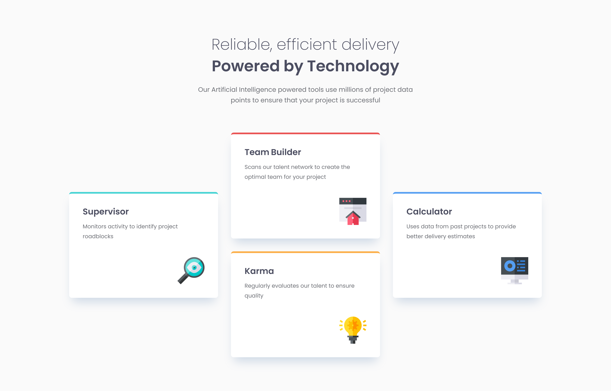

# Frontend Mentor - Four card feature section solution

This is a solution to the [Four card feature section challenge on Frontend Mentor](https://www.frontendmentor.io/challenges/four-card-feature-section-weK1eFYK). Frontend Mentor challenges help you improve your coding skills by building realistic projects. 

## Table of contents

- [Overview](#overview)
  - [The challenge](#the-challenge)
  - [Screenshot](#screenshot)
  - [Links](#links)
- [My process](#my-process)
  - [Built with](#built-with)
  - [What I learned](#what-i-learned)
  - [Continued development](#continued-development)
  - [Useful resources](#useful-resources)
- [Author](#author)

## Overview

### The challenge

Users should be able to:

- View the optimal layout for the site depending on their device's screen size

### Screenshot

### Links

- GitHub Repo: [https://github.com/IamAbhiDev/four-card-feature-section-master-new.github.io](https://github.com/IamAbhiDev/four-card-feature-section-master-new.github.io)
- Live Site: [https://iamabhidev.github.io/four-card-feature-section-master-new.github.io](https://iamabhidev.github.io/four-card-feature-section-master-new.github.io)

## My process

### Built with

- Semantic HTML5 markup
- CSS custom properties
- Flexbox
- CSS Grid
- Mobile-first workflow

### What I learned

While working on this project, I learned about analyzing the structure of the elements in a webpage and using CSS Grid to make the layout responsive. Instead of specifying margin and padding for every component to position it, I applied the Grid layout to the project for responsiveness.

### Continued development

In the future, I want to use Javascript to make my webpages more interactive and appealing. I also want to keep using `clamp()` for fluid typography. But I know I need to improve the code and make sure the webpage works well on all devices. I'll keep learning and following best practices to make great responsive designs.

### Useful resources

- [Accessibility Insights](https://accessibilityinsights.io) - This chrome extension helped me run automated checks to test the accessibility of the site.

## Author

- GitHub - [@IamAbhiDev](https://github.com/IamAbhiDev)
- Frontend Mentor - [@IamAbhiDev](https://www.frontendmentor.io/profile/IamAbhiDev)
- Twitter - [@IamAbhiDev](https://www.twitter.com/IamAbhiDev)